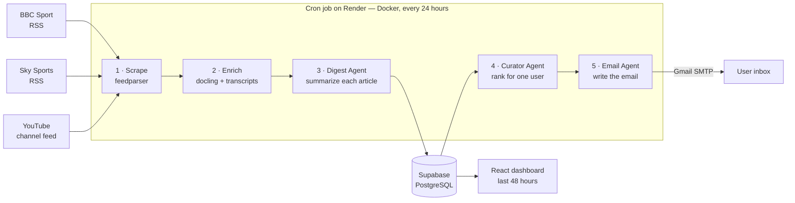
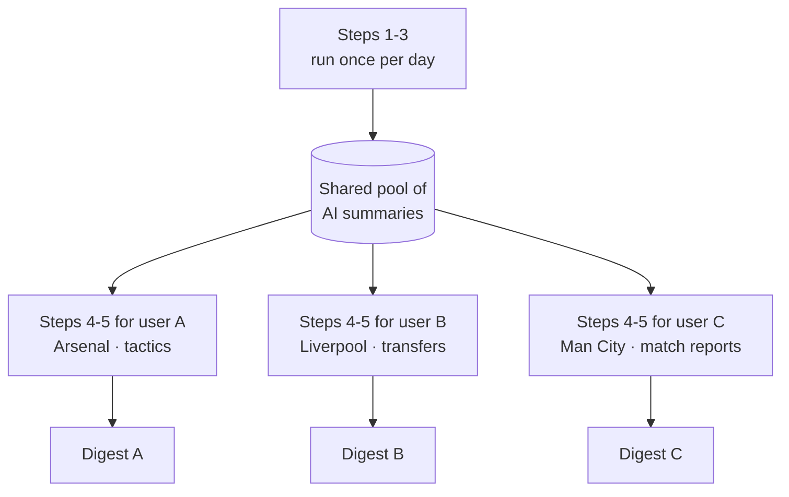

# Premier League Hub

A personalized Premier League news digest: AI agents collect, summarize and rank football news every day, then deliver a tailored edition to every registered user by email and on a web dashboard.

**Live app → [premier-league-hub-web.onrender.com](https://premier-league-hub-web.onrender.com/)**

---

## What it does

Every 24 hours, a scheduled job scrapes BBC Sport, Sky Sports and a YouTube channel, summarizes each item with an LLM, and then — for each registered user individually — ranks those summaries against that user's profile and writes them a personal email. One hundred users receive one hundred different digests, with no editorial work involved.

- **Sign up and onboard** in three steps: favourite clubs, expertise level, interests and digest size.
- **Personalization is a prompt, not a filter.** The onboarding profile is injected verbatim into the ranking prompt, and the curator explains why each story made the cut.
- **Two outputs from one run.** The same daily run fills the dashboard and sends the emails.
- **Bilingual interface** (English / German) with Supabase Auth and Row Level Security, so each user can only ever read their own data.

## Architecture



Steps 1–3 produce a **shared** pool of summaries: one article is summarized exactly once, no matter how many users are registered. Steps 4–5 are a loop over the `profiles` table, so LLM cost for the expensive summarization stage stays flat as the audience grows.



### The three agents

| Agent | Input | Output |
|---|---|---|
| **Digest Agent** | One scraped article or video transcript | A clean title and a two-to-three sentence summary, shared by all users |
| **Curator Agent** | The day's summaries + one user profile | A ranked list with a written justification per story |
| **Email Agent** | The top-ranked stories for that user | A personal greeting and the assembled digest, rendered to HTML |

Each agent is a single JSON-mode chat completion validated with Pydantic, with a safe fallback instead of an exception when the model misbehaves.

### Sources

| Source | Feed type | Enrichment |
|---|---|---|
| BBC Sport | Single RSS feed | None — the RSS description is used as-is |
| Sky Sports | Multiple RSS feeds | Full article HTML converted to markdown with `docling` |
| YouTube (Sky Sports Premier League) | Channel Atom feed | Video transcript via `youtube-transcript-api` |

### Data model

| Table | Purpose |
|---|---|
| `bbc_sport_articles`, `sky_sports_articles`, `youtube_videos` | Raw scraped items, deduplicated by `guid` / `video_id` |
| `digests` | One AI summary per item — global, shared by all users |
| `profiles` | One row per user: clubs, interests, expertise level, digest size |
| `saved_articles` | Articles a user starred in the dashboard |

## Tech stack

| Layer | Choice |
|---|---|
| Backend | Python 3.12, managed with [uv](https://docs.astral.sh/uv/) |
| Database | PostgreSQL on [Supabase](https://supabase.com/), accessed with SQLAlchemy |
| LLM | OpenAI API (`gpt-4o-mini` by default) |
| Scraping | `feedparser`, `youtube-transcript-api`, `docling` |
| Email | Gmail SMTP over `smtplib.SMTP_SSL` |
| Frontend | React 19, TypeScript, Vite, Tailwind CSS, shadcn/ui, React Router |
| Auth | Supabase Auth with Row Level Security |
| Infrastructure | Docker, Render (cron service + static site) |

## Project structure

```
backend/
  daily_runner.py            # the five-step pipeline, entrypoint for the cron job
  config.py                  # source configuration
  app/
    scrapers/                # bbc_sport.py, sky_sports.py, youtube.py
    services/                # enrichment, digest generation, email delivery
    agent/                   # digest_agent.py, curator_agent.py, email_agent.py
    database/                # SQLAlchemy models, connection, repository
frontend/
  src/
    pages/                   # Login, Signup, Onboarding, Dashboard
    components/              # team selector, lineup pitch, digest panel, shadcn/ui
    contexts/                # auth and language providers
    lib/                     # Supabase client, i18n dictionary, helpers
render.yaml                  # Render blueprint: cron service + static site
```

## Getting started

### Backend

```bash
cd backend

# local Postgres for development
docker compose -f docker/docker-compose.yml up -d

# secrets
cp app/services/example.env app/services/.env   # then fill in the values

# create the schema
uv run python -m app.database.create_tables

# run the full pipeline once
uv run python daily_runner.py
```

Every stage can also be run on its own, for example `uv run python -m app.services.process_digest`.

### Frontend

```bash
cd frontend
cp example.env .env          # then fill in the Supabase values
npm install
npm run dev
```

### Environment variables

| Variable | Used by | Purpose |
|---|---|---|
| `DATABASE_URL` | Backend | Supabase PostgreSQL connection string |
| `OPENAI_API_KEY` | Backend | Powers all three agents |
| `MY_EMAIL` / `APP_PASSWORD` | Backend | Gmail account and app password used to send the digests |
| `OPENAI_MODEL` | Backend | Optional, defaults to `gpt-4o-mini` |
| `VITE_SUPABASE_URL` / `VITE_SUPABASE_ANON_KEY` | Frontend | Supabase project credentials, read at build time |

## Deployment

`render.yaml` describes the whole deployment as a Render blueprint:

- a **cron service** that builds `backend/Dockerfile` and runs `python daily_runner.py` on a daily schedule,
- a **static site** that builds the Vite frontend and serves it with a rewrite so client-side routing survives a page refresh.

The database and authentication live in Supabase; secrets are entered in the Render dashboard rather than committed.

### Demo

https://github.com/user-attachments/assets/56bfb41a-7100-4e7c-879b-490dfc58a94d

